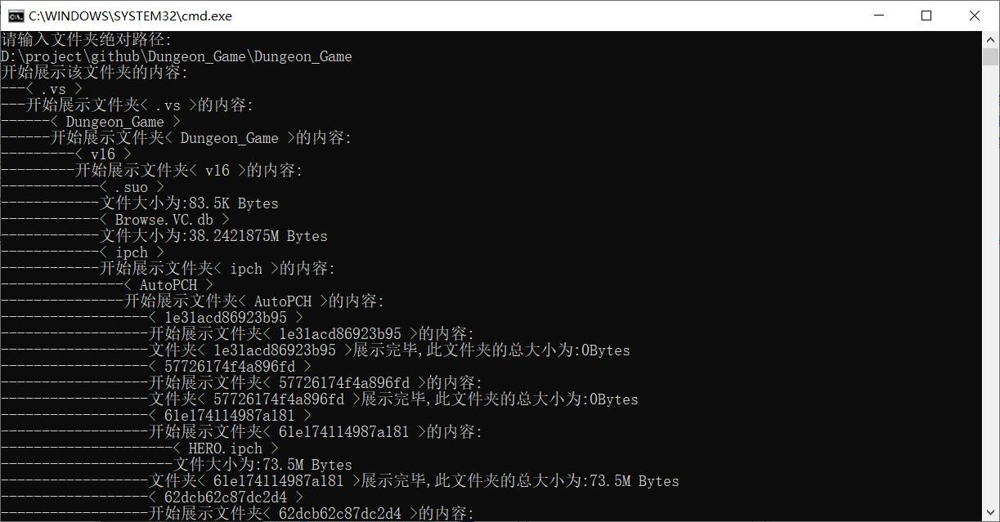
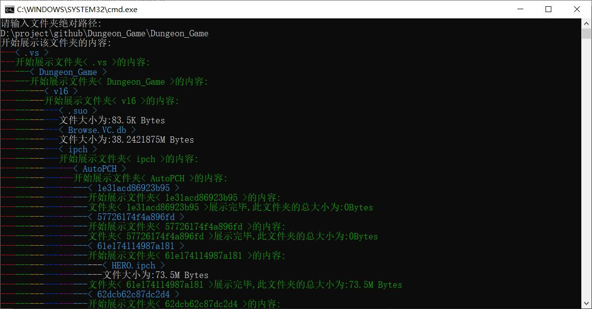

## 文件列表的读取
### 其分为两个版本
- Listed_files.py
- Listed_files_colorful.py
  
#### colorful 版本为 原版加上颜色显示

#### 对比图

#### <注>colorful版本在不同系统中可能出现转义乱码等情况，请安装对应版本 ansi189-bin.zip 转义，使用时请在python编辑器中执行。因其环境复杂性，故提供无颜色版本供简单使用

#### 项目链接 https://github.com/himcrh/Data-Structure-Meaning